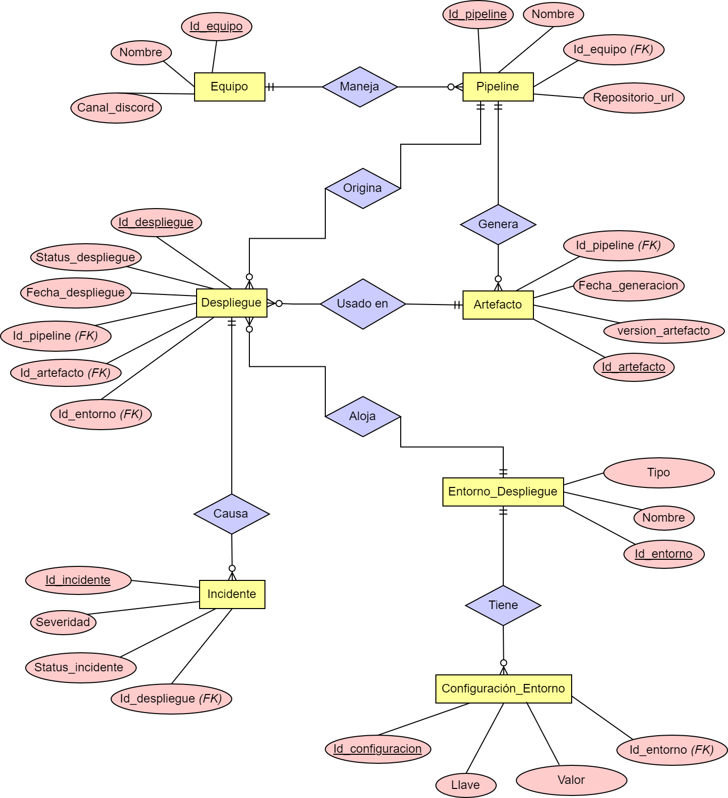

<div style="text-align: center;">


# Sistema de Monitoreo de Pipelines DevOps

</div>

**Alumno:** Luiggi Rodríguez Aliaga

<hr>

# Introducción

Este proyecto propone una base de datos para gestionar pipelines
DevOps, artefactos, despliegues e incidentes. Al centralizar los
datos de flujos CI/CD, las organizaciones pueden rastrear
despliegues, identificar cuellos de botella y resolver
incidentes eficientemente.

#### Conceptos Clave:

- **DevOps (Development and Operations)**: Conjunto de prácticas,
  filosofía y cultura que apunta a mejorar la colaboración y
  comunicación entre los equipos de Desarrollo y Operaciones. Su
  objetivo es acortar el ciclo de vida del software, entregar
  rápidamente software de alta calidad, y mejorar la confiabilidad
  y estabilidad de las aplicaciones en producción.

- **CI/CD (Continuous Integration/Continuous Delivery)**: Grupo de prácticas y herramientas utilizadas en el
  desarrollo de software para automatizar el proceso de construcción,
  testeo y despliegue de aplicaciones.

- **Pipeline**: Un flujo de trabajo CI/CD que automatiza la
  construcción, pruebas y despliegue de código desde un
  repositorio (ej: GitHub).

- **Artefacto**: Un paquete versionado (ej: imagen Docker,
  archivo JAR) generado durante la ejecución de un Pipeline. Suele
  ser una imagen de Docker que contiene la totalidad o componentes
  del código de desarrollo, archivos de configuración del mismo
  código y del contenedor.

# Objetivo

Diseñar una base de datos relacional que:

- Rastree ejecuciones de pipelines CI/CD.

- Monitoree entornos de despliegue y artefactos.

- Registre incidentes relacionados con los despliegues.

- Brinde visibilidad sobre responsabilidades de equipos
  y configuraciones de entornos de despliegue.

# Descripción del Problema

En DevOps, ocasionalmente los equipos enfrentan:

- Falta de trazabilidad centralizada de despliegues y estados
  de pipelines.

- Dificultad para vincular incidentes con despliegues específicos.

- Configuraciones inconsistentes de entornos de despliegue que
  causan fallos.

La propuesta de una **base de datos relacional** resuelve tales
problemas brindando las siguientes ventajas:

- Almacenar datos históricos para futuras auditorías.

- Garantizar consistencia de la información con claves foráneas.

- Vincular incidentes con despliegues y sus respectivos entornos.

- Mejoras continúas de procesos de desarrollo y operaciones a
  partir de la información obtenida.

# Modelo de Negocio

**Organización**: Empresa tecnológica con múltiples equipos DevOps
gestionando microservicios.

**Usuarios**: Ingenieros DevOps y SRE (Site Reliability Engineering),
y gerentes de proyecto.

**Propuesta de Valor**: Reducir fallos de despliegue y tiempo
de resolución de incidentes.

# Diagrama Entidad-Relación:

#### Diagrama



Leyenda:

- _Atributos_ -> Rojo
- _Entidades_ -> Amarillo
- _Relaciones_ -> Púrpura
- _Llave Primaria_ -> Atributo subrayado
- _Llave Foránea_ -> Atributo con _(FK)_

#### Entidades

- Equipo
- Pipeline
- Artefacto
- Despliegue
- Incidente
- Entorno_Despliegue (Entorno de Despliegue)
- Configuracion_Entorno (Configuración de Entorno de Despliegue)

#### Relaciones

- Un `Equipo` puede _manejar_ multiples `Pipelines`.
- Un `Pipeline` puede _originar_ multiples `Despliegues`.
- Varios `Despliegues` pueden _usar_ un mismo `Artefacto`.
- Un `Pipeline` puede _generar_ multiples `Artefactos`.
- Un `Entorno_Despliegue` puede _alojar_ multiples `Despliegues`.
- Varias `Configuraciones de Entorno` pueden ser _asignadas_ a un
  mismo `Entorno de Despliegue`.
- Varios `Incidentes` pueden ser _causados_ por un mismo `Despliegue`.

# Listado de Tablas

#### Tabla "Equipo"

| Campo         | Tipo de dato | AUTO_INCREMENT | UNIQUE | NOT NULL | PK  | FK  | Indexado |
| :------------ | :----------: | :------------: | :----: | :------: | :-: | :-: | :------: |
| Id_equipo     |     INT      |       X        |        |    X     |  X  |     |          |
| Nombre        | VARCHAR(50)  |                |        |    X     |     |     |          |
| Canal_discord | VARCHAR(50)  |                |   X    |    X     |     |     |          |

#### Tabla "Pipeline"

| Campo           | Tipo de dato | AUTO_INCREMENT | UNIQUE | NOT NULL | PK  | FK  | Indexado |
| :-------------- | :----------: | :------------: | :----: | :------: | :-: | :-: | :------: |
| Id_pipeline     |     INT      |       X        |        |    X     |  X  |     |          |
| Nombre          | VARCHAR(100) |                |        |    X     |     |     |          |
| Repositorio_url | VARCHAR(200) |                |   X    |    X     |     |     |          |
| Id_equipo       |     INT      |                |        |    X     |     |  X  |          |

#### Tabla "Artefacto"

| Campo             | Tipo de dato | AUTO_INCREMENT | UNIQUE | NOT NULL | PK  | FK  | Indexado |
| :---------------- | :----------: | :------------: | :----: | :------: | :-: | :-: | :------: |
| Id_artefacto      |     INT      |       X        |        |    X     |  X  |     |          |
| Version_artefacto | VARCHAR(20)  |                |   X    |    X     |     |     |          |
| Fecha_generacion  |   DATETIME   |                |        |    X     |     |     |          |
| Id_pipeline       |     INT      |                |        |    X     |     |  X  |          |

#### Tabla "Despliegue"

| Campo             | Tipo de dato | AUTO_INCREMENT | UNIQUE | NOT NULL | PK  | FK  | Indexado |
| :---------------- | :----------: | :------------: | :----: | :------: | :-: | :-: | :------: |
| Id_despliegue     |     INT      |       X        |        |    X     |  X  |     |          |
| Status_despliegue |     ENUM     |                |        |    X     |     |     |    X     |
| Fecha_despliegue  |   DATETIME   |                |        |    X     |     |     |          |
| Id_pipeline       |     INT      |                |        |    X     |     |  X  |          |
| Id_artefacto      |     INT      |                |        |    X     |     |  X  |          |
| Id_entorno        |     INT      |                |        |    X     |     |  X  |          |

#### Tabla "Incidente"

| Campo            | Tipo de dato | AUTO_INCREMENT | UNIQUE | NOT NULL | PK  | FK  | Indexado |
| :--------------- | :----------: | :------------: | :----: | :------: | :-: | :-: | :------: |
| Id_incidente     |     INT      |       X        |        |    X     |  X  |     |          |
| Severidad        |     ENUM     |                |        |    X     |     |     |          |
| Status_incidente |     ENUM     |                |        |    X     |     |     |    X     |
| Id_despliegue    |     INT      |                |        |    X     |     |  X  |          |

#### Tabla "Entorno_Despliegue"

| Campo      | Tipo de dato | AUTO_INCREMENT | UNIQUE | NOT NULL | PK  | FK  | Indexado |
| :--------- | :----------: | :------------: | :----: | :------: | :-: | :-: | :------: |
| Id_entorno |     INT      |       X        |        |    X     |  X  |     |          |
| Nombre     | VARCHAR(50)  |                |        |    X     |     |     |          |
| Tipo       |     ENUM     |                |        |    X     |     |     |          |

#### Tabla "Configuracion_Entorno"

| Campo            | Tipo de dato | AUTO_INCREMENT | UNIQUE | NOT NULL | PK  | FK  | Indexado |
| :--------------- | :----------: | :------------: | :----: | :------: | :-: | :-: | :------: |
| Id_configuracion |     INT      |       X        |        |    X     |  X  |     |          |
| Llave            | VARCHAR(50)  |                |        |    X     |     |     |          |
| Valor            | VARCHAR(200) |                |        |    X     |     |     |          |
| Id_entorno       |     INT      |                |        |    X     |     |  X  |          |

# Script SQL

```sql

-- Creación de base de datos

DROP DATABASE IF EXISTS monitoreo_devops;
CREATE DATABASE IF NOT EXISTS monitoreo_devops;
USE monitoreo_devops;

-- Creación de tablas

DROP TABLE IF EXISTS equipo;
CREATE TABLE IF NOT EXISTS equipo (
    id_equipo INT AUTO_INCREMENT,
    nombre VARCHAR(50) NOT NULL,
    canal_discord VARCHAR(50) NOT NULL UNIQUE,
    CONSTRAINT pk_equipo PRIMARY KEY (id_equipo)
);

DROP TABLE IF EXISTS pipeline;
CREATE TABLE IF NOT EXISTS pipeline (
    id_pipeline INT AUTO_INCREMENT,
    nombre VARCHAR(100) NOT NULL,
    repositorio_url VARCHAR(200) NOT NULL UNIQUE,
    id_equipo INT NOT NULL,
    CONSTRAINT pk_pipeline PRIMARY KEY (id_pipeline),
    CONSTRAINT fk_pipeline_equipo FOREIGN KEY (id_equipo)
        REFERENCES equipo (id_equipo)
);

DROP TABLE IF EXISTS artefacto;
CREATE TABLE IF NOT EXISTS artefacto (
    id_artefacto INT AUTO_INCREMENT,
    version_artefacto VARCHAR(20) NOT NULL UNIQUE,
    fecha_generacion DATETIME NOT NULL,
    id_pipeline INT NOT NULL,
    CONSTRAINT pk_artefacto PRIMARY KEY (id_artefacto),
    CONSTRAINT fk_artefacto_pipeline FOREIGN KEY (id_pipeline)
        REFERENCES pipeline (id_pipeline)
);

DROP TABLE IF EXISTS entorno_despliegue;
CREATE TABLE IF NOT EXISTS entorno_despliegue (
    id_entorno INT AUTO_INCREMENT,
    nombre VARCHAR(50) NOT NULL,
    tipo ENUM('Prod', 'Staging', 'Test') NOT NULL,
    CONSTRAINT pk_entorno PRIMARY KEY (id_entorno)
);

DROP TABLE IF EXISTS configuracion_entorno;
CREATE TABLE IF NOT EXISTS configuracion_entorno (
    id_configuracion INT AUTO_INCREMENT,
    llave VARCHAR(50) NOT NULL,
    valor VARCHAR(200) NOT NULL,
    id_entorno INT NOT NULL,
    CONSTRAINT pk_configuracion PRIMARY KEY (id_configuracion),
    CONSTRAINT fk_configuracion_entorno FOREIGN KEY (id_entorno)
        REFERENCES entorno_despliegue (id_entorno)
);

DROP TABLE IF EXISTS despliegue;
CREATE TABLE IF NOT EXISTS despliegue (
    id_despliegue INT AUTO_INCREMENT,
    status_despliegue ENUM('Success', 'Failed', 'Pending') NOT NULL,
    fecha_despliegue DATETIME NOT NULL,
    id_pipeline INT NOT NULL,
    id_artefacto INT NOT NULL,
    id_entorno INT NOT NULL,
    CONSTRAINT pk_despliegue PRIMARY KEY (id_despliegue),
    CONSTRAINT fk_despliegue_pipeline FOREIGN KEY (id_pipeline)
        REFERENCES pipeline (id_pipeline),
    CONSTRAINT fk_despliegue_artefacto FOREIGN KEY (id_artefacto)
        REFERENCES artefacto (id_artefacto),
    CONSTRAINT fk_despliegue_entorno FOREIGN KEY (id_entorno)
        REFERENCES entorno_despliegue (id_entorno),
    INDEX idx_status (status_despliegue)
);

DROP TABLE IF EXISTS incidente;
CREATE TABLE IF NOT EXISTS incidente (
    id_incidente INT AUTO_INCREMENT,
    severidad ENUM('Low', 'Medium', 'High') NOT NULL,
    status_incidente ENUM('Open', 'Closed') NOT NULL,
    id_despliegue INT NOT NULL,
    CONSTRAINT pk_incidente PRIMARY KEY (id_incidente),
    CONSTRAINT fk_incidente_despliegue FOREIGN KEY (id_despliegue)
        REFERENCES despliegue (id_despliegue),
    INDEX idx_status (status_incidente)
);

```
